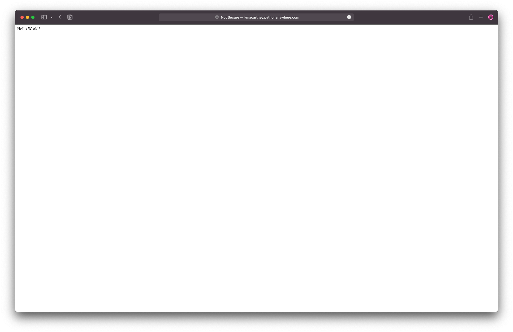

# Pricing-server-2022

A simple HTTP Server which will return the prices of different hotels around the world.

Written in Python

## Create Virtual environment

This will allwo you to run your code without poluting your global python installation

```
python3 -m venv venv
```

## Installing Depedencies

Install the dependencies by running 
```
pip install -r requirements.txt
```

## Running the website
The website can be staarted by running

```
python3 -m flask run
```

Navigate to the website on by entering `http://127.0.0.1:5000` in your browser.

# Hosting my server

We will host our app for free on the site [Python-Anywhere](https://www.pythonanywhere.com/). It lets you host python code online completely free. 

## Preparing to host
### Go to Python anywhere home
1. Go to Python-Anywhere and click the "Web" button


2. Click on "Add new web app"


3. Follow the instructions on the new window, by clicking "Next". On the window below make sure you seect "Flask".


4. Select "Python 3.6 (Flask 2.0.0)

 

6. On this window, please enter `/home/<REPLACE_WITH_USER>/mysite/app.py` into the `Path` textbox. This points to the python file containing your server code `app.py`.

`

7. We now need to upload our python file, Under the title "Code" next to "Source code:" click "Go to directory".


8. Click on "the Upload a file" button and navigate to your python project. Select your `app.py` file and click on upload. It should look like this:


9. While on the same page, click on the button "Open Bash console here". This will open a black screen looking like this. This is a terminal to your server!


10. We need to prepare a virtual environment for our app. We do so by running the follow commands one after the other

```bash
mkvirtualenv --python=/usr/bin/python3.6 my-virtualenv 

pip3 install flask-cors
```

10. When those commands have completed running, press the back button on your browser, and navigate to "Web" by clicking it on the top navigation bar.


12. Click the green "Reload" button and wait for a moment till the spinner goes away. Click the link next to "Configuration for", to open your website. Your website is now LIVE!



13. Now update `http://127.0.0.1:5000` in `pricing-server.js` in your React project with your new website url. This will now start calling your website through the internet.
```javascript
async function callPricingService(path) {
    const hostUrl = "http://kmacartney.pythonanywhere.com/"  // <--- U P D A T E  H E R E
    const pricingUrl = hostUrl + path
    console.log("Getting price")

    return (await fetch(pricingUrl).then(resp => resp.text()))
}
```